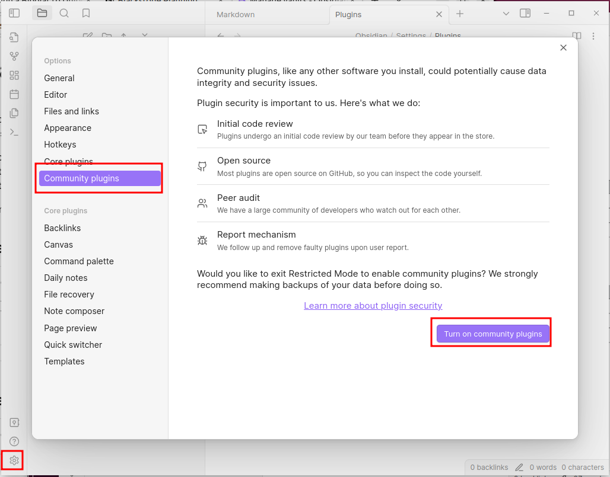
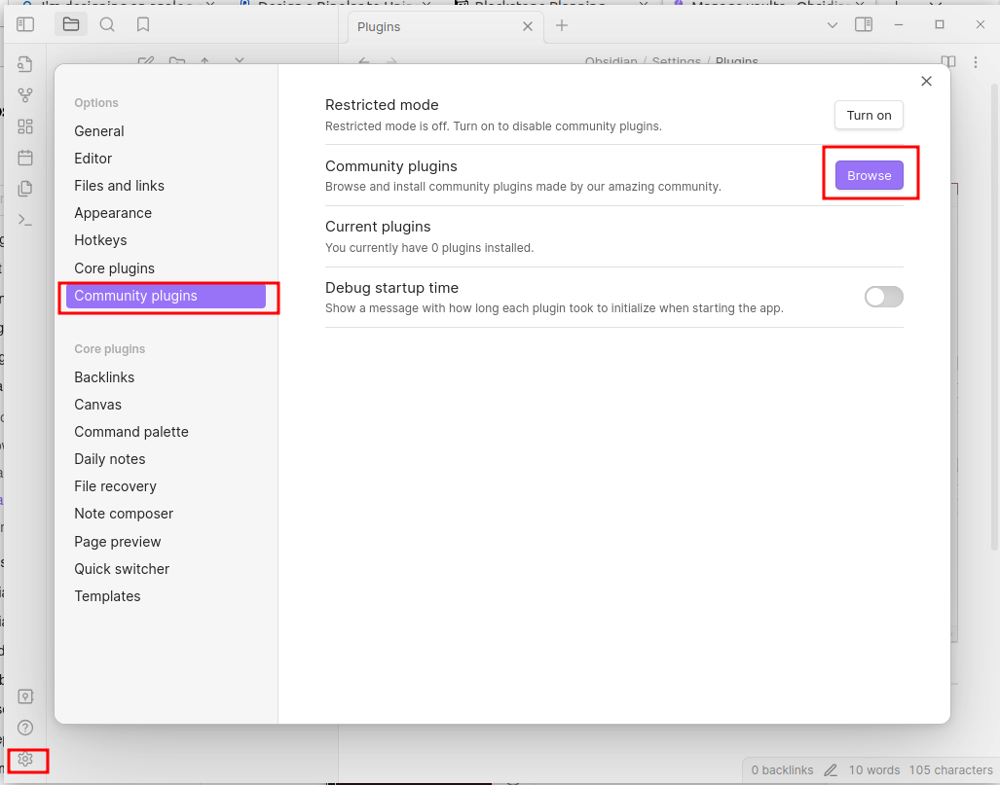
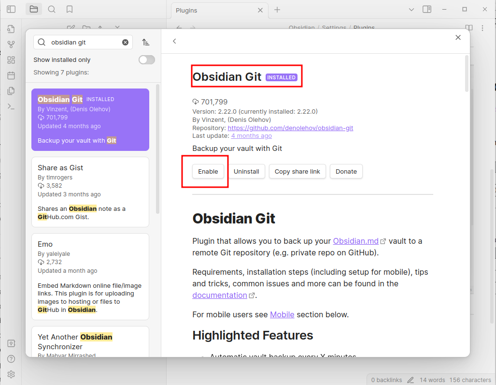

* Enable Community Plugins
* Browse/Search "Obsidian Git"
* Configuration:
	* Backup every 20 minutes
	* Pull on Startup

*Enable Community Plugins*

-----
*Browse Community Plugins*

-----
*Enabled*

----

